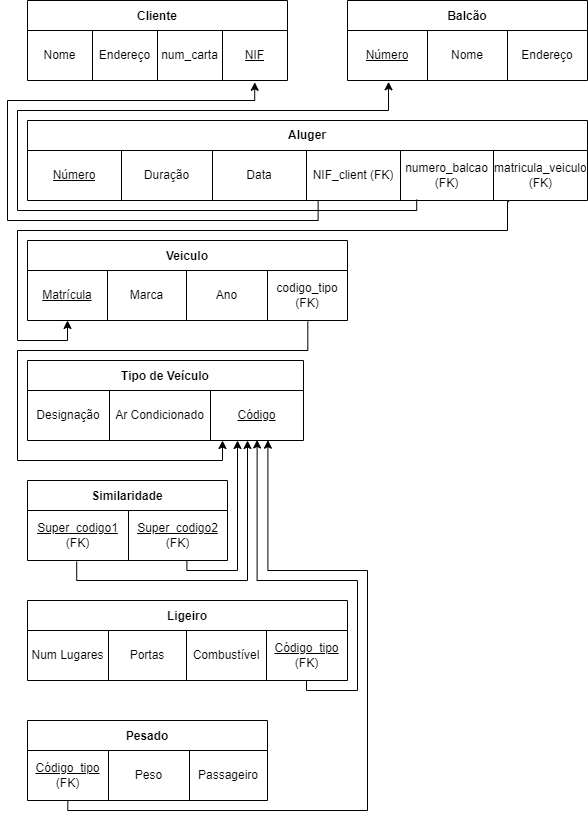
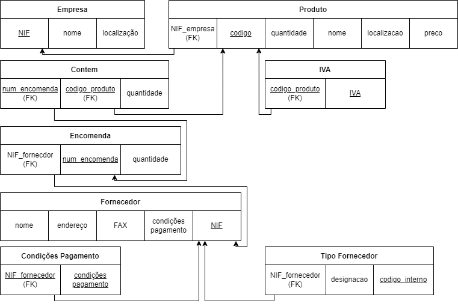
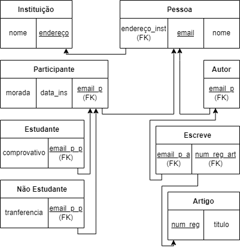

# Lab03
## Grupo - **P2G2**

| Membros | Número Mecanográfico |
| :- | :-: |
| Miguel Nogueira | 93082 |
| David Ferreira | 93444 |

## Exercício 3.1
### a)

- Cliente( <u>NIF</u>, num_carta, endereço, nome ),
- Aluger(<u>numero</u>, duração, data, NIF_cliente, numero_balcao, Matricula_veiculo),
- Balcao(<u>numero</u>, nome, endereço),
- Veiculo(<u>matricula</u>, marca, ano, codigo_tipo),
- Tipo_veiculo(<u>codigo</u>, arcondicionado, designacao),
- Similaridade(<u>codigo_veiculo1</u>,<u>codigo_veiculo2</u>),
- Ligeiro(<u>codigo_tipo</u>, numlugares, portas, combustivel),
- Pesado(<u>codigo_tipo</u>, peso, passageiros).

### b)

| Tabela | Chaves Candidatas | Chaves Primárias | Chaves Estrangeiras |
| - | - | - | - |
| **Cliente** | NIF, num_carta | NIF | - |
| **Aluguer** | numero | numero | NIF_cliente   numero_balcao   matricula_veiculo |
| **Balcao** | numero, endereço | numero | - |
| **Veiculo** | matricula | matricula | codigo_tipo |
| **Tipo_veiculo** | codigo | codigo | - |
| **Similaridade** | codigo_veiculo1   + codigo_veiculo2 | codigo_veiculo1   + codigo_veiculo2 | codigo_veiculo1   + codigo_veiculo2 |
| **Ligeiro** | codigo_tipo | codigo_tipo | codigo_tipo |
| **Pesado** | codigo_tipo | codigo_tipo | codigo_tipo |

### c)

## Exercício 3.2
### a)

- Airport(<u>airport_code</u>, city, state, name),
- Flight_leg(<u>leg_no</u>, <u>number_flight</u>, airport_code1, arr_time, airport_code2, dep_time),
- Flight(<u>number</u>, airline, weekdays),
- Fare(<u>code</u>, amount, restrictions, <u>number_flight</u>),
- Leg_instance(no_avail_seats, <u>Date</u>,<u>leg_no</u>,<u>number_flight</u> ,airplane_id, arr_time, dep_time, airport_code1, airport_code2),
- Seat(<u>seat_no</u>, customer_name, cphone, <u>date</u>, <u>leg_no</u>, <u>number_flight</u>),
- Airplane(<u>airplane_id</u>, total_seats, type_name)
- Airplane_type(<u>type_name</u>, max_seats, company),
- Can_land(<u>type_name</u>,<u>airport_code</u>),

### b)

| Tabela | Chaves Candidatas | Chaves Primárias | Chaves Estrangeiras |
| - | - | - | - |
| **Airport** | airport_code | airport_code | - |
| **Flight_leg** | leg_no  + number_flight | leg_no  + number_flight | number_flight   airport_code1   airport_code2|
| **Flight** | number | number| - |
| **Fare** | code  + number_flight | code  + number_flight | number_flight |
| **Leg_instance** | date  +leg_no  +number_flight | date  +leg_no  +number_flight| leg_no   number_flight   airplane_id   airport_code1   airport_code2|
| **Seat** | seat_no  + date  + leg_no  + number_flight | seat_no  + date  + leg_no  + number_flight | date   leg_no   number_flight   |
| **Airplane** | airplane_id | airplane_id | type_name |
| **Airplane_type** | type_name | type_name | - |
| **Can_land** | type_name  + airport_code | type_name  + airport_code | type_name   airport_code|

### c)

## Exercício 3.3

## Lab 02 2.1

## Lab 02 2.2

## Lab 02 2.3

## Lab 02 2.4

