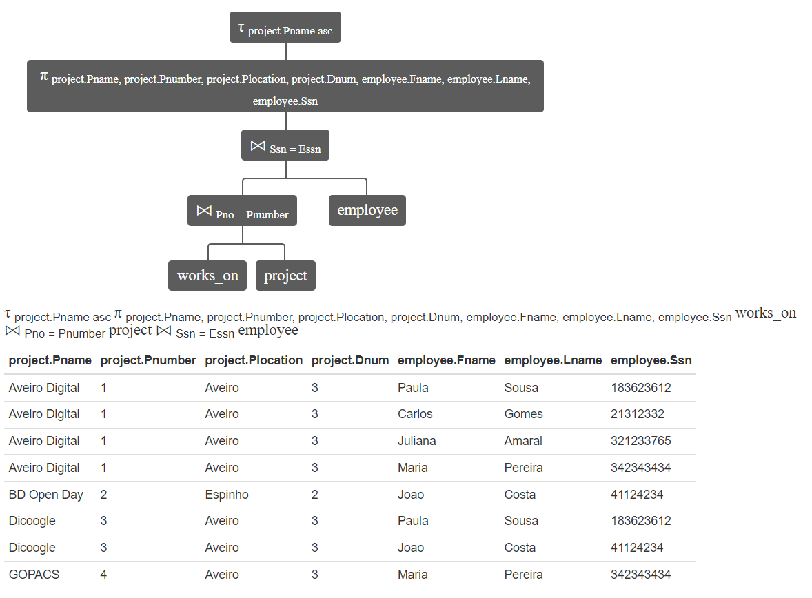
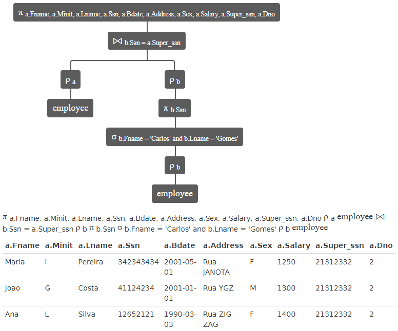
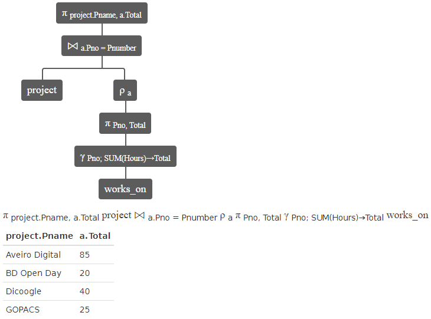
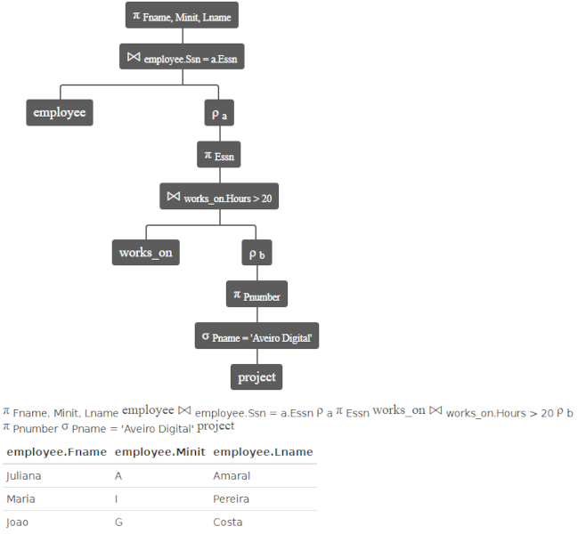
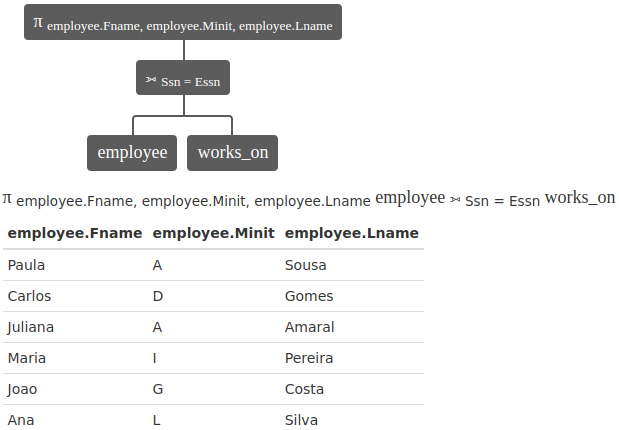
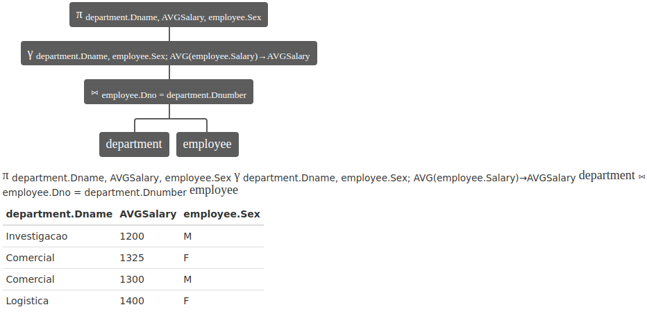
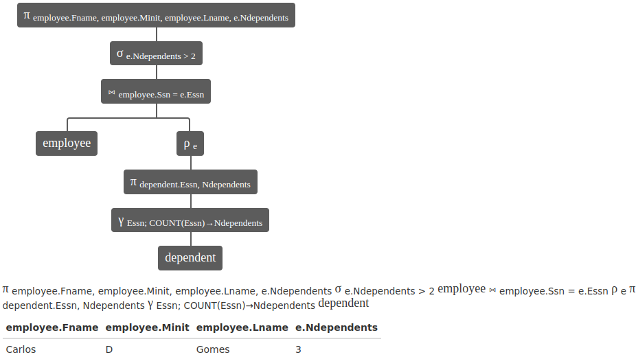
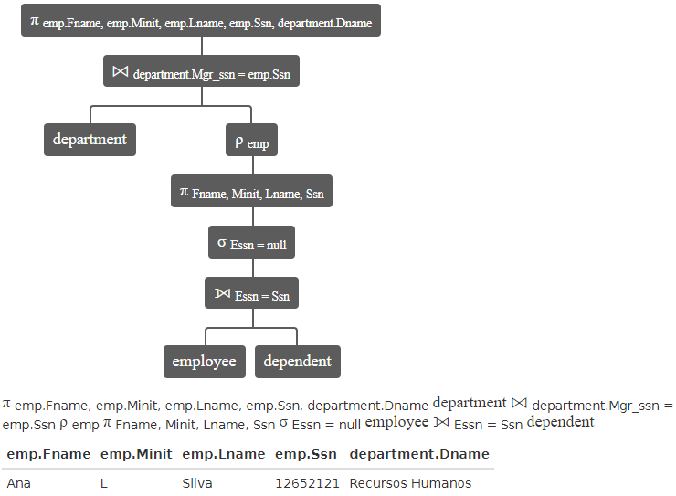
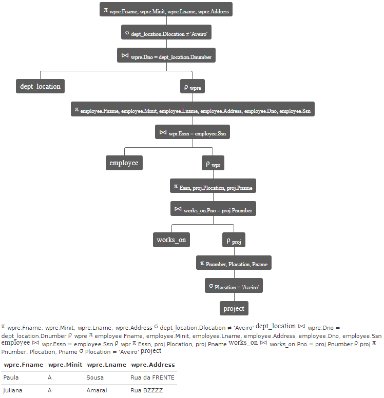

# Lab05

## Grupo - **P2G2**

| Membros | Número Mecanográfico |
| :- | :-: |
| David Araújo | 93444 |
| Miguel Nogueira | 93082 |

## Exercicio 1

### a)
>π project.Pname, project.Pnumber, project.Plocation, project.Dnum, employee.Fname, employee.Lname, employee.Ssn works_on ⨝ Pno = Pnumber project ⨝ Ssn = Essn employee

```` SQL
SELECT project.*, employee.Fname, employee.Lname, employee.Ssn
FROM works_on
INNER JOIN project on Pno=Pnumber
INNER JOIN employee on Ssn=Essn
````



<div style="page-break-after: always;"></div>

### b)

> π a.Fname, a.Minit, a.Lname, a.Ssn, a.Bdate, a.Address, a.Sex, a.Salary, a.Super_ssn, a.Dno ρ a employee ⨝ b.Ssn = a.Super_ssn ρ b π b.Ssn σ b.Fname = 'Carlos' and b.Lname = 'Gomes' ρ b employee

```` SQL
SELECT a.*
FROM employee AS a
INNER JOIN (
    SELECT b.Ssn
    FROM employee as b
    WHERE b.Fname='Carlos' AND b.Lname='Gomes')
AS b
ON b.Ssn = a.Super_ssn;
````



<div style="page-break-after: always;"></div>

### c)

>π project.Pname, a.Total project ⨝ a.Pno = Pnumber ρ a π Pno, Total γ Pno; SUM(Hours)→Total works_on
````SQL
SELECT project.Pname, a.Total
FROM project
INNER JOIN (
    SELECT Pno, SUM(Hours) AS Total
    FROM works_on
    GROUP BY Pno)
AS a
ON (a.Pno=Pnumber);
````



<div style="page-break-after: always;"></div>

### d)

>π Fname, Minit, Lname employee ⨝ employee.Ssn = a.Essn ρ a π Essn works_on ⨝ works_on.Hours > 20 ρ b π Pnumber σ Pname = 'Aveiro Digital' project
````SQL
SELECT Fname, Minit, Lname
FROM employee
INNER JOIN (
    SELECT Essn
    FROM works_on
    INNER JOIN (
        SELECT Pnumber
        FROM project
        WHERE Pname='Aveiro Digital')
    AS b
    ON works_on.Hours > 20)
AS a
ON employee.Ssn = a.Essn
````



<div style="page-break-after: always;"></div>

### e)

>π employee.Fname, employee.Minit, employee.Lname employee ⟕ Ssn = Essn works_on
````SQL
SELECT employee.Fname, employee.Minit, employee.Lname
FROM employee
LEFT JOIN works_on
ON Ssn=Essn
WHERE Essn IS NULL;
````



<div style="page-break-after: always;"></div>

### f)

>π department.Dname, AVGSalary, employee.Sex γ department.Dname, employee.Sex; AVG(employee.Salary)→AVGSalary department ⨝ employee.Dno = department.Dnumber employee
````SQL
SELECT department.Dname, AVG(employee.Salary) AS AVGSalary, employee.Sex
FROM department
INNER JOIN employee
ON employee.Dno=department.Dnumber
GROUP BY department.Dname, employee.Sex;
````



<div style="page-break-after: always;"></div>

### g)

>π employee.Fname, employee.Minit, employee.Lname, e.Ndependents σ e.Ndependents > 2 employee ⨝ employee.Ssn = e.Essn ρ e π dependent.Essn, Ndependents γ Essn; COUNT(Essn)→Ndependents dependent
````SQL
SELECT employee.Fname, employee.Minit, employee.Lname, e.Ndependents
FROM employee
INNER JOIN (
 SELECT dependent.*, COUNT(Essn) AS Ndependents
 FROM dependent
 GROUP BY Essn
) AS e
ON employee.Ssn = e.Essn
WHERE e.Ndependents>2;
````



<div style="page-break-after: always;"></div>

### h)

>

````SQL

````



<div style="page-break-after: always;"></div>

### i)

>

````SQL

````



<div style="page-break-after: always;"></div>
