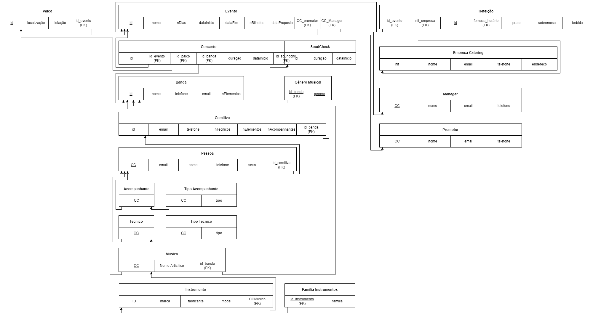
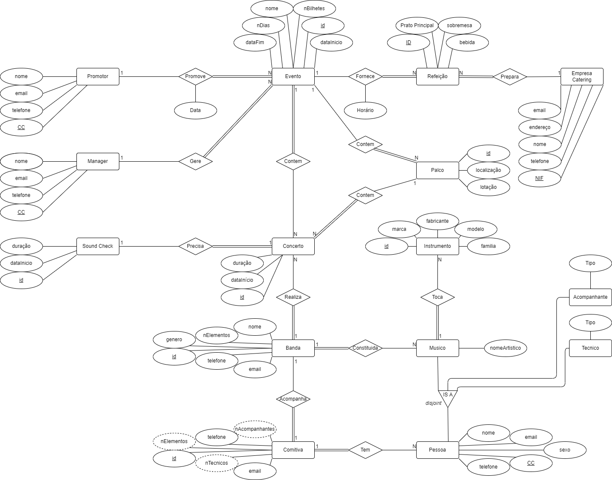

# <t style="color:#0080ff">Gestor de Festivias Musicais</t>

## Proposta de Projeto para Base de Dados - **P2G2**

- David Araújo - 93444
- Miguel Nogueira - 93082

## Requisitos

Os utilizadores serão capazes de interagir com o sistema da seguinte forma:

- Inserir/Remover concertos e todas as informações associadas a estes.
- Inserir/Remover informação sobre o *Manager* e o *Promotor*.
- Inserir/Remover informação dos materias que os artistas trazem.
- Inserir/Remover informação relativamente às comitivas que acompanham os artistas.
- Inserir/Remover palcos.
- Associar/Dessasociar concertos a palcos.
- Inserir/Remover informação relativamente às refeições e empreas de Catering.
- Confirgurar toda a informação do evento em si, assim como consultá-la.
- Inserir/Remover bandas, associa-las a concertos.

## Equema Relacional

## Diagrama Entidade-Relacionamento

